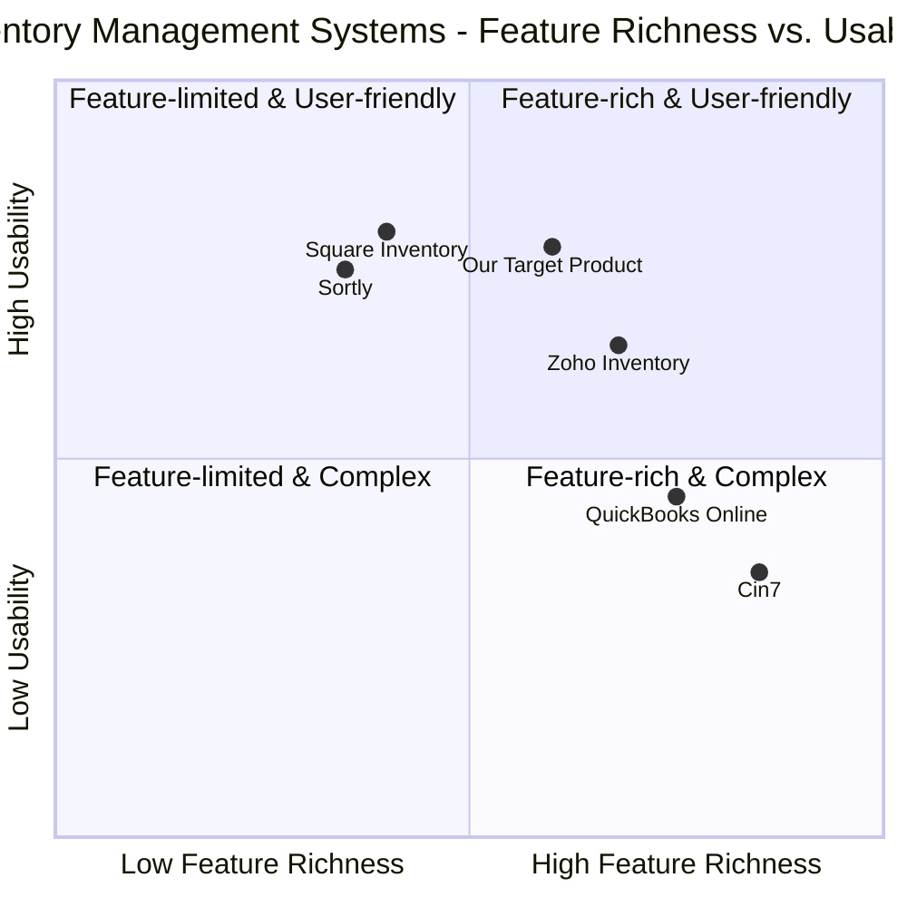

# Product Requirements Document: Inventory & Sales Management System

## 1. Introduction

### 1.1 Purpose
This document outlines the requirements for developing a comprehensive Inventory and Sales Management System. The system will enable users to track inventory items, create products from raw materials, monitor costs and profits, and generate receipts for customers.

### 1.2 Original Requirements
The client has requested a web application with the following features:
- Inventory management for raw materials/items with costs tracking
- Product management showing items made from raw materials
- Cost calculation for both inventory and finished products
- Sales tracking with revenue monitoring
- Receipt generation for customer purchases
- Ability to track expenditures and revenue

### 1.3 Scope
The system will be developed as a web application using React, JavaScript, and Tailwind CSS. It will focus on inventory management, product creation, sales tracking, financial reporting, and receipt generation.

## 2. Product Definition

### 2.1 Product Goals
1. Create a seamless inventory management system that tracks raw materials and finished products
2. Provide accurate cost and revenue tracking to enable profitability analysis
3. Streamline the sales process with automated receipt generation for improved customer experience

### 2.2 User Stories

1. **As a business owner**, I want to add inventory items with costs so that I can track my material expenses accurately.
2. **As a product manager**, I want to create product entries that use specific inventory items so that I can track what materials go into each product.
3. **As a sales representative**, I want to record sales transactions and generate professional receipts so that I can provide customers with proper documentation.
4. **As a financial officer**, I want to view reports on costs and revenue so that I can assess business profitability.
5. **As an inventory manager**, I want to receive alerts when inventory is low so that I can reorder materials before they run out.

### 2.3 Competitive Analysis

| Product | Pros | Cons |
|---------|------|------|
| **Zoho Inventory** | - Excellent multichannel support<br>- Cloud-based access from anywhere<br>- Good integration options<br>- Free tier available | - Limited customization<br>- More complex than needed for some users<br>- Advanced features require higher-tier plans |
| **QuickBooks Online** | - Strong accounting integration<br>- Reputable brand<br>- Comprehensive reporting | - Expensive monthly fees<br>- Overkill for small operations<br>- Learning curve for new users |
| **Square Inventory** | - Free with POS system<br>- Easy-to-use interface<br>- Good in-store/online integration | - Limited advanced inventory features<br>- Tied to Square ecosystem<br>- Basic manufacturing features |
| **Cin7** | - Advanced inventory tracking<br>- Robust multichannel capabilities<br>- Detailed analytics | - High cost<br>- Complexity for small businesses<br>- Setup time investment |
| **Sortly** | - User-friendly mobile app<br>- Simple interface<br>- Custom fields | - Limited manufacturing focus<br>- Basic reporting<br>- Limited integrations |
| **Our Target Product** | - Focus on raw materials to finished products<br>- Cost tracking throughout production<br>- Simplified receipt generation<br>- Affordable price point | - New to market<br>- Limited initial integrations<br>- Web-only platform initially |

### 2.4 Competitive Quadrant Chart



## 3. Technical Specifications

### 3.1 Requirements Analysis

The application must fulfill several key functions to meet the business requirements:

1. **Inventory Management**
   - Track raw materials with quantities and costs
   - Calculate total inventory value
   - Alert when inventory is low
   - Record inventory additions and usage

2. **Product Management**
   - Define products made from inventory items
   - Specify quantities of raw materials needed per product
   - Calculate production costs based on material usage
   - Set and track selling prices and profit margins

3. **Sales Tracking**
   - Record customer purchases
   - Track quantity of products sold
   - Calculate revenue from sales
   - Monitor profit/loss based on production costs vs. sales

4. **Receipt Generation**
   - Create professional receipts for customers
   - Include business information, date, and transaction details
   - List purchased items with quantities, unit prices, and totals
   - Calculate taxes if applicable
   - Support printing and email sending of receipts

5. **Reporting**
   - Generate cost reports for inventory and production
   - Provide revenue and profit analysis
   - Track historical sales and inventory usage

### 3.2 Requirements Pool

#### P0 (Must-have)
- User authentication and access control
- Inventory item management (CRUD operations)
- Product definition with material requirements
- Basic sales recording
- Simple receipt generation
- Cost calculation for inventory and products
- Dashboard with key metrics

#### P1 (Should-have)
- Bulk import/export for inventory and products
- Low stock alerts and notifications
- Tax calculation in receipts
- Multiple pricing options (retail, wholesale)
- Basic reporting for costs and revenue
- Customer database
- Receipt templates customization

#### P2 (Nice-to-have)
- Barcode scanning integration
- Advanced analytics and reporting
- Multiple locations/warehouse support
- Supplier management
- Automatic reordering
- Mobile application
- API for third-party integrations

### 3.3 UI Design Draft

#### Main Dashboard Layout
```
+--------------------------------------------------------------+
|                     Header / Navigation                       |
+--------------------------------------------------------------+
|                                                              |
|  +---------------+   +---------------+   +---------------+   |
|  |  Inventory    |   |   Products    |   |     Sales     |   |
|  |  Summary      |   |   Summary     |   |    Summary    |   |
|  | $XXX in stock |   | XX products   |   | $XXX revenue  |   |
|  +---------------+   +---------------+   +---------------+   |
|                                                              |
|  +------------------------------------------------------+   |
|  |                                                      |   |
|  |                   Recent Activity                    |   |
|  |                                                      |   |
|  +------------------------------------------------------+   |
|                                                              |
|  +-------------------+        +------------------------+    |
|  | Low Stock Alerts  |        | Profitability Overview |    |
|  +-------------------+        +------------------------+    |
|                                                              |
+--------------------------------------------------------------+
```

#### Inventory Management Interface
```
+--------------------------------------------------------------+
|                     Header / Navigation                       |
+--------------------------------------------------------------+
|  [+ Add New Item]                [Search...]     [Filter ▼]   |
+--------------------------------------------------------------+
|                                                              |
|  +----------+---------------+----------+----------+--------+ |
|  | Item ID  |  Item Name    | Quantity | Cost/Unit| Total  | |
|  +----------+---------------+----------+----------+--------+ |
|  | INV001   | Fabric        |  50 yds  |  $5.00   | $250.00| |
|  | INV002   | Thread        | 100 spls |  $1.25   | $125.00| |
|  | INV003   | Buttons       | 500 pcs  |  $0.10   |  $50.00| |
|  | ...      | ...           | ...      | ...      | ...    | |
|  +----------+---------------+----------+----------+--------+ |
|                                                              |
|                       Pagination Controls                    |
|                                                              |
+--------------------------------------------------------------+
```

#### Product Creation Interface
```
+--------------------------------------------------------------+
|                     Header / Navigation                       |
+--------------------------------------------------------------+
|  Product Details                                              |
|  +--------------------------------------------------------+  |
|  | Product Name: [                                       ] |  |
|  | Description:  [                                       ] |  |
|  | Selling Price: [        ]                               |  |
|  +--------------------------------------------------------+  |
|                                                              |
|  Materials Required                                          |
|  +----------+----------------+----------+-------------+      |
|  | Material |     Name       | Quantity | Cost Impact |      |
|  +----------+----------------+----------+-------------+      |
|  | [Select▼]| Fabric         |  [2.5]   |   $12.50    |  [X] |
|  | [Select▼]| Thread         |  [1.0]   |    $1.25    |  [X] |
|  | [Select▼]| Buttons        |  [5.0]   |    $0.50    |  [X] |
|  | [+ Add Material]                                     |      |
|  +----------+----------------+----------+-------------+      |
|                                                              |
|  Production Summary                                          |
|  +--------------------------------------------------------+  |
|  | Total Cost:           $14.25                            |  |
|  | Selling Price:        $29.99                            |  |
|  | Profit Margin:        $15.74 (52.5%)                    |  |
|  +--------------------------------------------------------+  |
|                                                              |
|  [Cancel]                                        [Save]      |
|                                                              |
+--------------------------------------------------------------+
```

#### Sales Recording Interface
```
+--------------------------------------------------------------+
|                     Header / Navigation                       |
+--------------------------------------------------------------+
|  Sale Information                                             |
|  +--------------------------------------------------------+  |
|  | Customer: [Select Customer ▼] or [+ Add New Customer]   |  |
|  | Date: [05/30/2025]                                      |  |
|  | Payment Method: [Credit Card ▼]                         |  |
|  +--------------------------------------------------------+  |
|                                                              |
|  Products Sold                                               |
|  +----------+----------------+------+--------+--------+      |
|  | Product  |     Name       | Qty  | Price  | Total  |      |
|  +----------+----------------+------+--------+--------+      |
|  | [Select▼]| T-Shirt        | [2]  | $29.99 | $59.98 |  [X] |
|  | [Select▼]| Jacket         | [1]  | $89.99 | $89.99 |  [X] |
|  | [+ Add Product]                                      |      |
|  +----------+----------------+------+--------+--------+      |
|                                                              |
|  Sale Summary                                                |
|  +--------------------------------------------------------+  |
|  | Subtotal:           $149.97                             |  |
|  | Tax (8.25%):        $12.37                              |  |
|  | Total:              $162.34                             |  |
|  | Cost of Goods:      $67.49                              |  |
|  | Profit:             $82.48 (55%)                        |  |
|  +--------------------------------------------------------+  |
|                                                              |
|  [Cancel]        [Save]        [Save & Generate Receipt]      |
|                                                              |
+--------------------------------------------------------------+
```

#### Receipt View
```
+--------------------------------------------------------------+
|                                                              |
|                      BUSINESS NAME                           |
|                      Address Line 1                          |
|                      City, State ZIP                         |
|                      Phone: (555) 555-5555                   |
|                                                              |
|  Receipt #: REC-2025-001                   Date: 5/30/2025   |
|                                                              |
|  Customer: John Smith                                        |
|  Email: john@example.com                                     |
|                                                              |
|  +----------+-------------------------+-----+-------+-------+ |
|  | Item     | Description             | Qty | Price | Total | |
|  +----------+-------------------------+-----+-------+-------+ |
|  | T-Shirt  | Cotton T-Shirt, Blue    |  2  | 29.99 | 59.98 | |
|  | Jacket   | Winter Jacket, Black    |  1  | 89.99 | 89.99 | |
|  +----------+-------------------------+-----+-------+-------+ |
|                                                              |
|                                        Subtotal: $149.97    |
|                                        Tax (8.25%): $12.37  |
|                                        TOTAL: $162.34       |
|                                                              |
|  Payment Method: Credit Card                                 |
|                                                              |
|  Thank you for your business!                                |
|                                                              |
|  [Print Receipt]     [Email Receipt]     [Download PDF]      |
|                                                              |
+--------------------------------------------------------------+
```

### 3.4 Open Questions

1. **Customer Data Requirements**: What customer information should be stored? Is there a need for customer relationship management features?

2. **Tax Handling**: Should the system support multiple tax rates for different locations or product categories?

3. **Integration Requirements**: Are there existing systems (accounting, e-commerce) that this application should integrate with?

4. **User Roles**: What different roles are needed (admin, manager, sales staff), and what permissions should each have?

5. **Scalability Considerations**: What is the expected volume of inventory items, products, and sales transactions?

## 4. Implementation Considerations

### 4.1 Technical Stack

- **Frontend**: React.js with Tailwind CSS for responsive design
- **Backend**: Node.js with Express
- **Database**: MongoDB for flexibility in data structure
- **Authentication**: JWT-based authentication system
- **Hosting**: AWS or similar cloud platform for scalability

### 4.2 Development Phases

**Phase 1 (MVP):**
- User authentication system
- Basic inventory management
- Simple product creation
- Sales recording
- Basic receipt generation

**Phase 2:**
- Enhanced reporting
- Customer management
- Advanced receipt customization
- Low stock alerts
- Data import/export functionality

**Phase 3:**
- Advanced analytics
- Mobile responsiveness improvements
- Integration capabilities
- Barcode scanning (if needed)

### 4.3 Estimated Timeline

- **Planning and Design**: 2 weeks
- **Phase 1 Development**: 6 weeks
- **Phase 2 Development**: 4 weeks
- **Phase 3 Development**: 4 weeks
- **Testing and Refinement**: Throughout each phase
- **Total Estimated Timeline**: 16 weeks

## 5. Success Metrics

- **Accuracy**: 100% accuracy in inventory tracking and cost calculations
- **Efficiency**: Reduction in time spent on inventory management by at least 50%
- **User Adoption**: 90% of target users actively using the system after training
- **Error Reduction**: Decrease in inventory discrepancies by at least 75%

## 6. Conclusion

This Inventory and Sales Management System will provide a comprehensive solution for tracking materials and products, monitoring costs, recording sales, and generating professional receipts. The system will help businesses maintain accurate inventory records, understand their profitability, and provide better customer service through streamlined sales processes.
